# 📚 Management Perpustakaan

Sistem Manajemen Perpustakaan berbasis Laravel dan Filament Admin Panel. Proyek ini memungkinkan pengelolaan data buku, anggota, dan transaksi peminjaman dengan tampilan dashboard yang responsif dan mudah digunakan.

---

## 📌 Daftar Isi

- [Dibangun Dengan](#-dibangun-dengan)  
- [Fitur](#-fitur)  
- [Flowchart Instalasi](#-flowchart-instalasi)  
- [Langkah Instalasi](#-langkah-instalasi)  
- [Konfigurasi Environment](#-konfigurasi-environment)  
- [Migrasi & Seeder Database](#-migrasi--seeder-database)  
- [Instalasi Filament](#-instalasi-filament)  
- [Membuat User Admin](#-membuat-user-admin)  
- [Menjalankan Aplikasi](#-menjalankan-aplikasi)  
- [Kontribusi](#-kontribusi)  
- [Lisensi](#-lisensi)  
- [Kontak](#-kontak)  

---

## 🔧 Dibangun Dengan

- [Laravel](https://laravel.com/) – Framework PHP  
- [Filament](https://filamentphp.com/) – Admin Panel Laravel  
- MySQL / PostgreSQL – Basis Data  
- Composer – Manajer Dependency PHP  
- Node.js & NPM – Kompilasi Aset Frontend  

---

## ✨ Fitur

- 📚 **Manajemen Buku**: Tambah, ubah, dan hapus data buku  
- 👤 **Manajemen Anggota**: Kelola data anggota perpustakaan  
- 🔁 **Transaksi Peminjaman**: Peminjaman dan pengembalian buku  
- 🔐 **Autentikasi Admin**: Login aman dengan Filament  
- 📱 **UI Responsif**: Tampilan dashboard yang mendukung perangkat mobile  

---

## 📈 Flowchart Instalasi

```mermaid
flowchart LR
    A[Clone Repository] --> B[Install Dependency PHP]
    B --> C[Salin & Konfigurasi .env]
    C --> D[Generate App Key]
    D --> E[Migrasi & Seed Database]
    E --> F[Install Filament]
    F --> G[Buat User Admin]
    G --> H[Jalankan Server]
    H --> I[Akses Dashboard /admin]
```



---

## 🚀 Langkah Instalasi

1. **Clone repository**  
   ```bash
   git clone https://github.com/adidarma24/ManagementPerpustakaan.git
   cd ManagementPerpustakaan
   ```
2. **Install dependency PHP**  
   ```bash
   composer install
   ```
3. **Install dependency NodeJS (jika menggunakan aset frontend)**  
   ```bash
   npm install
   npm run dev
   ```

---

## ⚙️ Konfigurasi Environment

1. **Salin file `.env`**  
   ```bash
   cp .env.example .env
   ```
2. **Edit file `.env` sesuai konfigurasi lokal kamu:**  
   ```env
   APP_NAME=Perpustakaan
   APP_URL=http://localhost:8000

   DB_CONNECTION=mysql
   DB_HOST=127.0.0.1
   DB_PORT=3306
   DB_DATABASE=perpustakaan
   DB_USERNAME=root
   DB_PASSWORD=
   ```
3. **Generate application key**  
   ```bash
   php artisan key:generate
   ```

---

## 🧪 Migrasi & Seeder Database

1. **Jalankan migrasi database**  
   ```bash
   php artisan migrate
   ```
2. *(Opsional)* Jika terdapat seeder:  
   ```bash
   php artisan db:seed
   ```

---

## 🧩 Instalasi Filament

Jika Filament belum terpasang, jalankan:  
```bash
composer require filament/filament
php artisan filament:install
```

---

## 👤 Membuat User Admin

```bash
php artisan make:filament-user
```  
Masukkan nama, email, dan password sesuai instruksi terminal.

---

## ▶️ Menjalankan Aplikasi

```bash
php artisan serve
```  
Akses aplikasi melalui browser:  
```
http://localhost:8000/admin
```  
Login menggunakan akun admin yang sudah dibuat.

---

## 🤝 Kontribusi

Kontribusi sangat terbuka!  
Silakan fork repositori ini, buat branch baru, dan kirimkan pull request.

---

## 📄 Lisensi

Proyek ini dilisensikan di bawah MIT License – lihat file [LICENSE](LICENSE) untuk detail.

---

*Silakan gunakan proyek ini untuk pembelajaran atau pengembangan sistem perpustakaan internal. Jangan lupa beri bintang ⭐ jika kamu merasa ini bermanfaat!*
